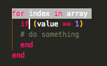
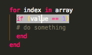

# Ruby/Python Code Block Highlighter

This extension is designed to: (Ruby) help identify the innermost block that the current line belongs to, or (Python) help match the current line to its parent scope.

## Usage

* First, either select the the line (drag over it with the mouse) or place the cursor on top of it.
* Next, trigger the command by pressing Alt + H or by choosing "Show Start Of Block"/"Show Start Of Scope" from the Command Palette.  
  
  
  
  
* The line that starts the innermost block/scope of the selected line will be highlighted.  
    
  
* **(RUBY)** Where you place your cursor within the line may matter. For example, if you place your cursor before, on, or directly after the keyword "if" (and it's the first keyword in the line that starts a block), the if statement's parent block will be highlighted. However, if you place your cursor completely after the keyword "if" as such: "if |" (where | is the cursor), the if statement itself will be highlighted, since you are now within its scope.  
   
  
* The extension supports Python as well, though the functionality is somewhat different than with Ruby. In Python, the parent scope of the selected line will be highlighted. Therefore if the cursor is place on an a line in an "elif" conditional, for example, when the command is activated, the elif will be highlighted. However with Ruby, the if statement that the elsif belongs to will be highlighted.  
    
    
  
* To remove the highlight, click elsewhere on the file.  
  
## Known Bugs  
  
### Ruby

* In the case where there are two or more open braces on the same line, with no closing braces in between, the highlighting will fail.  
  
However, putting the code on one line will fix the bug.  
  
Something like this would also work.  
  
  
## Dependencies

* [vscode-textmate](https://github.com/Microsoft/vscode-textmate)

## Extension Settings

The highlight color can be changed via the "configuration" settings:

* highlightColor.color: Specifies the color code for the highlighting. The default is #BABABA. If an invalid code is provided, the color will default to #BABABA.
  

## Commands/Keybindings

The keybinding for the extension can be changed via the "keybindings" settings  
  
  

###### Honorary Beta Tester: Fenhan Wang
