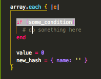
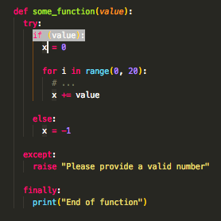
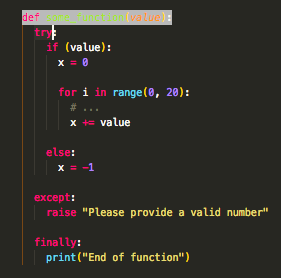

# Ruby Code Block Highlighter

This extension is designed to help identify the starting line of a block that matches with a particular "end" keyword in Ruby.

## Usage

* First, either select the the line (drag over it with the mouse) or place the cursor on top of it.
* Next, trigger the command by pressing Alt + H or by choosing "Show Start Of Block" from the Command Palette.  
  

  
* The line that starts the innermost scope of the selected line will be highligted.  
  
  
* The extension supports Python as well, though the functionality is somewhat different than with Ruby. In Python, the parent scope of the selected line will be highlighted. Therefore if the cursor is place on an "if" conditional, for example, when the command is activated, the parent scope of that if statement will be highlighted, not the if statement itself like with Ruby. This is because the functionality for Ruby is to find the beginning of the innermost block for a certain line, including the line itself. For Python, the functionality is to match a line to its parent scope.  
    
  
* To remove the highlight, click elsewhere on the file.  
  
## Known Bugs

* In the case where there are two or more open braces on the same line, with no closing braces in between, the highlighting will fail.  
  
However, putting the code on one line will fix the bug. 
  
Something like this would also work.  
  

## Dependencies

* [vscode-textmate](https://github.com/Microsoft/vscode-textmate)

## Extension Settings

The highlight color can be changed via the "configuration" settings:

* highlightColor.color: Specifies the color code for the highlighting. The default is #BABABA. If an invalid code is provided, the color will default to #BABABA.
  

## Commands/Keybindings

The keybinding for the extension can be changed via the "keybindings" settings  
  

