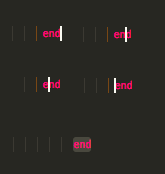

# Ruby Code Block Highlighter

This extension is designed to help identify the beginning line of a block that matches with a particular "end" keyword in Ruby.

## Usage

* First, either select the word "end" (drag over the word with the mouse) or place the cursor on top of it. The cursor can be placed anywhere within, behind, or after the word "end" to work.  

* Next, trigger the command by choosing "Show Start Of Block" from the Command Palette, or by pressing Shift + F.
  

* The matching start line of the block will be highlighted.
* To remove the highlight, click elsewhere on the file.

## Dependencies

* [vscode-textmate](https://github.com/Microsoft/vscode-textmate)

## Extension Settings

The highlight color can be changed via the configuration settings:

* highlightColor.color: Specifies the color code for the highlighting. The default is #BABABA. If an invalid code is provided, the color will default to #BABABA.

## Commands/Keybindings

